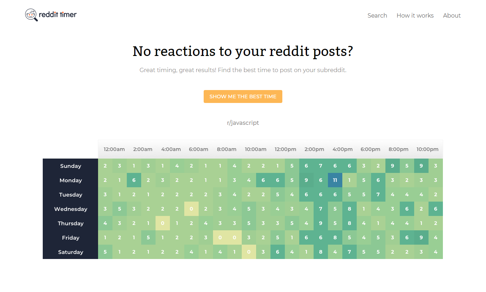
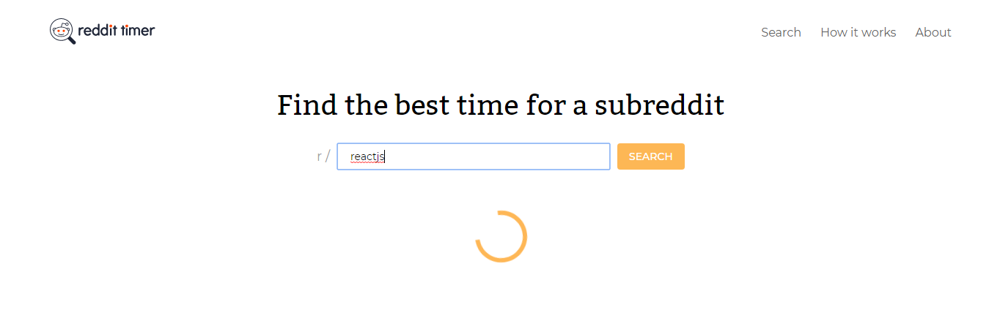

<h1 align="center"> Welcome to Reddit Timer App 👋</h1>
<p align="center">
  
  <a href="#" target="_blank">
    
  </a>
  <a href="https://twitter.com/kelvin9877" target="_blank">
    
  </a>
    <a href="https://app.netlify.com/sites/reddittimer/deploys" target="_blank">
    
  </a>
 
</p>

[](https://reddittimer.netlify.app/)
> Use a heatmap to show users what is the best time to post in a given subreddit.

[](https://reddittimer.netlify.app/search/reactjs)
> Search In progress

## About This Project

I implemented this project in the context of a course at [ooloo.io](https://ooloo.io/). This course mimics a professional real-world development environment.

Designs were provided via [Zeplin](https://zeplin.io/). The project was split into small tasks using [Asana](https://app.asana.com/) as a project management tool. I created a pull request for every task. The code was reviewed line by line by [Johannes](https://jkettmann.com/author/johannes/), a senior developer.

In this project I have been exposed to many practical techniques that I wouldn't have learned otherwise. Examples as following but not limit to: 

* **Creating pixel-perfect designs**
* **Planning and implementing a [complex UI component](https://github.com/ooloo-io/reddit-timer-kelvin8773/blob/master/src/main/components/search/heatMap.js#L92)**
* **[Implement data fetching with error handling](https://github.com/ooloo-io/reddit-timer-kelvin8773/blob/master/src/main/components/search/searchResult.js#L37)**
* **Debugging inside an IDE**
* **[Writing integration tests](https://dev.to/jkettmann/inside-a-dev-s-mind-refactoring-and-debugging-a-react-test-2jap)**
* **Professional Git workflow with pull requests**
* **Code reviews**
* **Continuous integration**

I was free to choose any technical stack, packages, and coding styles to finish the project as long as I met the acceptance criteria of a given task. The only limitation was to use React.

The code reviews gave me insights into best practices to follow (see [this example](https://github.com/ooloo-io/reddit-timer-kelvin8773/pull/11#pullrequestreview-412073827)). I was able to learn a lot and evolve my front-end knowledge rapidly.

Inspired by some of the concepts introduced in this project I wrote up an article to teach other junior developers [how to get started writing tests for React applications](https://dev.to/kelvin9877/how-to-write-tests-for-react-in-2020-4oai). **This article was very well-received. It got 200+ reactions and was featured in the dev.to newsletter.**


### ✨ [Demo Link](https://reddittimer.netlify.app/)

## Tech Stack
 * React (Hook)
 * Redux Tool kit
 * Styled-component

## Tools Use for the Project
* [Zeplin](https://zeplin.io/) - Where the design from
* [Perfect Pixel](https://chrome.google.com/webstore/detail/perfectpixel-by-welldonec/dkaagdgjmgdmbnecmcefdhjekcoceebi?hl=en) - To Help create Pixel perfect Layout
* [Asana](https://app.asana.com/) - Project Management Tool
* Github - Version control & team collaboration
* Slack - Team communication tool


### Install
```sh
yarn install
```

### Usage
```sh
yarn start
```

### Run tests
```sh
yarn test
```

## Author
👤 **Kelvin Liang**

* Website: https://kelvinliang.cn
* Twitter: [@kelvin9877](https://twitter.com/kelvin9877)
* LinkedIn: [@kelvin9877](https://linkedin.com/in/kelvin9877)


***
***Special Thanks to [ooloo.io](https://ooloo.io/) and [Johannes Kettmann](https://jkettmann.com).***